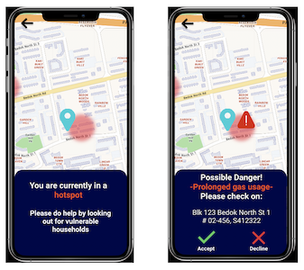

# Detailed Proposal of *Responders Unite*

In this document, we will elaborate on *Responders Unite*, a platform that seeks to **bring individual CFRs together** to grow a dedicated and interconnected core of community responders, a smart application that **alerts them of potential accidents** that warrant their attention, and **eases the collaboration between CFRs and SCDF**.

To address each of our promise, we detail how our application works and provide mockup(s) in the three sections below.

## Bringing Individual CFRs Together: The Forum

The forum enables CFRs to share experiences and tips with fellow CFRs, enabling them to learn from one another and improve their knowledge and skills. CFRs from the same region can also flag out vulnerable groups of people so that other CFRs in the region can look out for them.

## Alerts CFRs of potential accidents: The Map and The Intelligent System

The difference between this and myResponder’s equivalent is that it marks out certain regions where vulnerable groups of people stay. These people, like seniors who live alone, have higher risk of home accidents. By indicating these regions on the Map, CFRs can be more alert at these areas to respond more quickly to any possible emergencies. Additionally, with all the smart sensor data now in 2025, we can detect when a home accident is likely to occur and alert CFRs nearby to check on the potential victims. All these features are integrated into Responders Unite.

## Eases collaboration between CFRs and the SCDF: The Newsletters and The Chatbot

With ONE platform to connect all CFRs, it becomes much easier for SCDF to disseminate educational material and empower all CFRs to be more effective in their intervention. Moreover, in the event of fire incidents, SCDF can very easily request information from nearby CFRs to supplement information flows. The chatbot feature also prompts CFRs to provide more useful information to SCDF regarding incidents. All in all, this enables CFRs to collaborate more effectively with SCDF.

