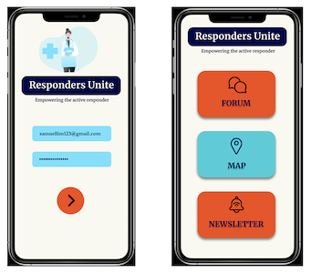
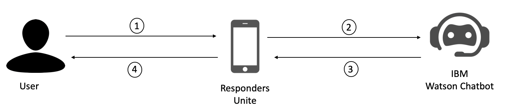

# BlueTeam-RespondersUnite_SCDFXIBM
We are coders who aspire to make a difference and here is our attempt at doing so. ☺️

## Overview

We decided to tackle the first problem *Emergency Medical Services*. Specifically, we propose to enhance SCDF's myResponder application to further empower CFRs (Community First Responders). This will reduce the workload of SCDF and allow them to redirect their efforts to more urgent crises, as well as develop a more resilient and united community. 

Our application *Responders Unite* is not only a platform that seeks to **bring individual CFRs together**, but also **provides them with relevant information** that facilitates faster response, a smart application that **alerts them of potential accidents** that warrant their attention, and **eases the collaboration between CFRs and SCDF**.

To make the above a reality, we propose to
* create a forum for individuals living in the same region to share their ideas, thoughts and tips
* disseminate relevant information to CFRs (e.g. tips that will benefit CFRs, stories of other CFRs, etc. ) via e-newsletters
* utilise data analytics for the detection of vulnerable groups of individuals, which can, in turn, heighten the alertness of CFRs, enabling them to respond more quickly when an accident occurs
* harness the power of machine intelligence (specifically, the artificial recurrent neural network architecture *Long short-term memory*) and internet of things for the prediction of possible accidents that might otherwise go unnoticed
* implement a chatbot that helps SCDF to gather more relevant information from CFRs in times of emergency

## Pitch Video

Here is our pitch: 

## Architecture of Our Proposed Solution

The following figures are the architecture diagrams of our solution. They have been separated into three diagrams for clarity. However, they represent the same system. 

*Note that we intentionally left out the architecture diagram for the forum and e-newsletters out because we intend to use standard implementation of such features*

### Using Analytics and CFR-Provided Information to Detect Vulnerable Groups

1. CFR informs the system of the presence of vulnerable individuals in his/her area (e.g. neighbourhood)
2. Cloud storage stores information, and server analyses and creates map that informs users that there are many vulnerable individuals (e.g. elderly who have no next of kin) in the area
3. Updates information shown on map
4. Renders updated map for CFR to inform CFR whether there are many/few vulnerable individuals in that region

### Using Machine Intelligence for the Prediction of Potential Unnoticed Accidents

### Using Chatbot to Gather Relevant Information

1. CFR provides information of accident
2. Information is analysed by chatbot
3. Chatbot asks more relevant questions to gather necessary information/thank the user
4. CFR views question (and return to step 1 until chatbot stops asking)

## Details of Our Solution

You can find our solution [here](DESCRIPTION.md).

## Built With

1. IBM Watson Assistant to create the chatbot
2. Android Studios
3. Figma
